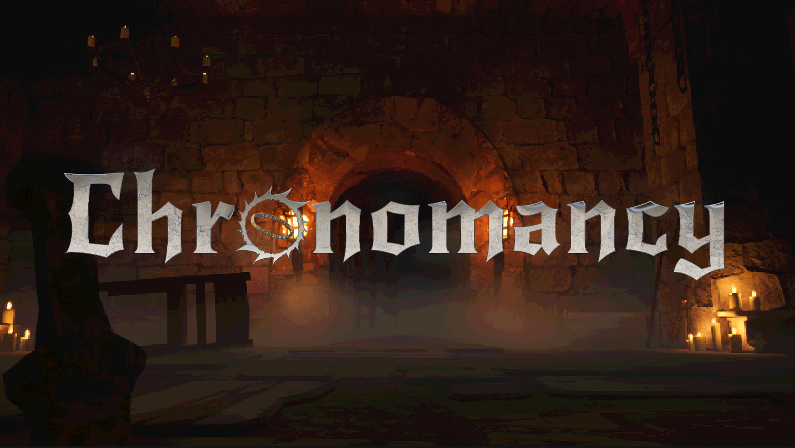
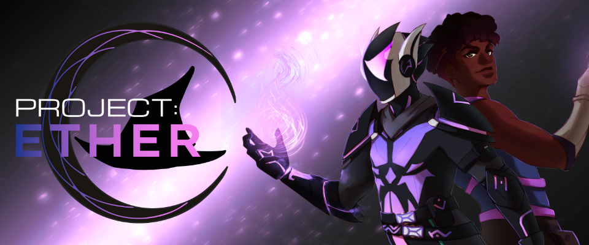
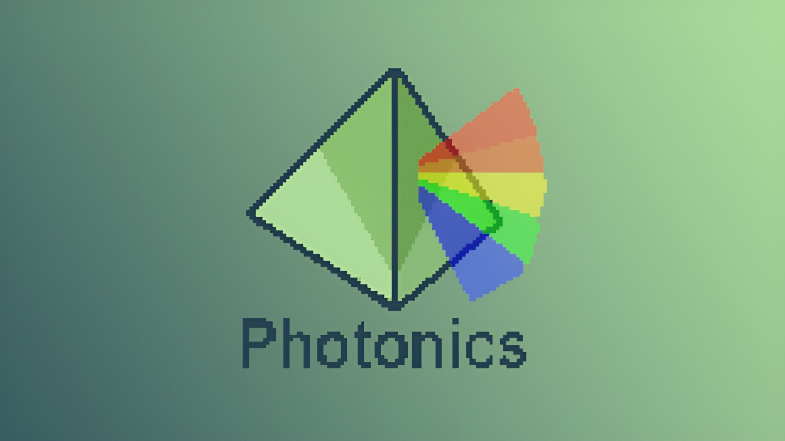
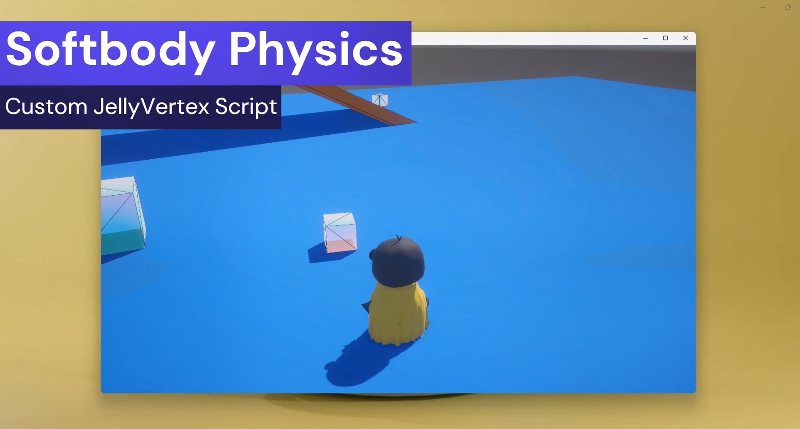
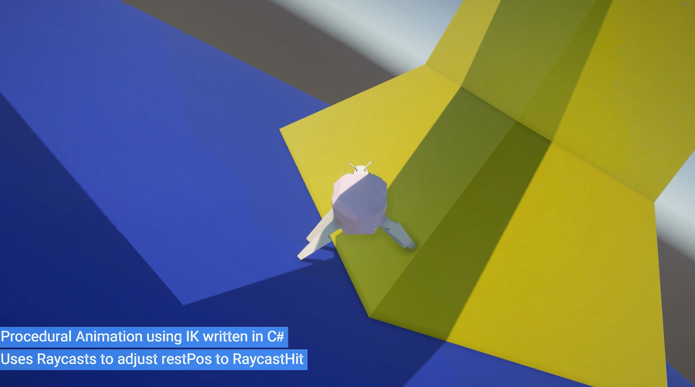

<link rel="stylesheet" href="{{ '/assets/css/style.css' | relative_url }}">

<h2><strong><strong class="highlight-text">// </strong>The Scraprooms</strong></h2>
<h5>2025 | Unity 6 URP | <strong class="highlight-text">Environment / Lighting / UI</strong></h5>
<!-- <h5>May 2024 | Unity | Team size: 5</h5>

Lorem ipsum dolor sit amet. Lorem ipsum dolor sit amet. Lorem ipsum dolor sit amet. Lorem ipsum dolor sit amet. Lorem ipsum dolor sit amet. Lorem ipsum dolor sit amet. Lorem ipsum dolor sit amet. 

-->

<!---->
    

<h2><strong><strong class="highlight-text">// </strong>Chronomancy</strong></h2>
<h5>2024 | Unreal 5 | <strong class="highlight-text">Art / Environment / Lighting</strong></h5>
<!-- <h5>May 2024 | Unity | Team size: 5</h5>

Lorem ipsum dolor sit amet. Lorem ipsum dolor sit amet. Lorem ipsum dolor sit amet. Lorem ipsum dolor sit amet. Lorem ipsum dolor sit amet. Lorem ipsum dolor sit amet. Lorem ipsum dolor sit amet. 

-->

    

<h2><strong><strong class="highlight-text">// </strong>Convergence</strong></h2>
<h5>2024 | Unity | <strong class="highlight-text">Art / Sound / Design</strong></h5>

    

<h2><strong><strong class="highlight-text">// </strong>Project: Ether</strong></h2>
<h5>2024 | Unreal 5 | <strong class="highlight-text">Animation Programmer</strong></h5>

    

<!-- 
<iframe width="100%" height="350" src="https://www.youtube.com/embed/NQFwHyNttlo?si=MTZ5PVpDfmt3c4Lq" title="YouTube video player" frameborder="0" align="center" allow="accelerometer; autoplay; clipboard-write; encrypted-media; gyroscope; picture-in-picture; web-share" allowfullscreen></iframe>
 -->
<!--  -->

<h2><strong><strong class="highlight-text">// </strong>Photonics</strong></h2>
<h5>2023 | Unity | <strong class="highlight-text">Art / UI / Animation</strong></h5>

    

<h2><strong><strong class="highlight-text">// </strong>Cel-Shaded Terrain Demo</strong></h2>
<h5>2022 | Unity | <strong class="highlight-text">Art / 3D Modeling / Technical Art</strong></h5>

    

<h2><strong><strong class="highlight-text">// </strong>Physics Shader Demo</strong></h2>
<h5>2022 | Unity | <strong class="highlight-text">3D Modeling / Technical Art</strong></h5>

    

<h2><strong><strong class="highlight-text">// </strong>Procedural Animation Demo</strong></h2>
<h5>2022 | Unity | <strong class="highlight-text">3D Modeling / Animation Programmer</strong></h5>

<!-- 
Lorem ipsum dolor sit amet. Lorem ipsum dolor sit amet. Lorem ipsum dolor sit amet. Lorem ipsum dolor sit amet. Lorem ipsum dolor sit amet. Lorem ipsum dolor sit amet. Lorem ipsum dolor sit amet. 
 -->

   

<button class="theme-button" onclick="window.location.href='{{ site.url }}{{ site.baseurl }}/artwork/';">View Artwork</button>

 

<!--
{::comment}
My main areas of expertise are <strong>graphic design</strong>, <strong>front-end development</strong>, and <strong>character art</strong>.

Pursuing my passion for digital art and storytelling through game development, I've been particularly interested in a revival of early 2000s design standards due to their focus on physically bringing people together and engaging them through movement and competition, such as games like Wii Sports, Just Dance, and Guitar Hero, to name a few.

Write your biography here. Tell the world about yourself. Link to your favorite [subreddit](http://reddit.com). You can put a picture in, too. The code is already in, just name your picture `prof_pic.jpg` and put it in the `img/` folder.

Put your address / P.O. box / other info right below your picture. You can also disable any of these elements by editing `profile` property of the YAML header of your `_pages/about.md`. Edit `_bibliography/papers.bib` and Jekyll will render your [publications page](/al-folio/publications/) automatically.

Link to your social media connections, too. This theme is set up to use [Font Awesome icons](https://fontawesome.com/) and [Academicons](https://jpswalsh.github.io/academicons/), like the ones below. Add your Facebook, Twitter, LinkedIn, Google Scholar, or just disable all of them.
{:/comment}
-->