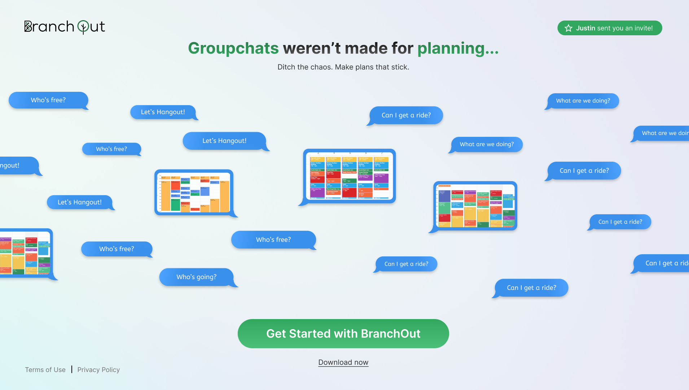
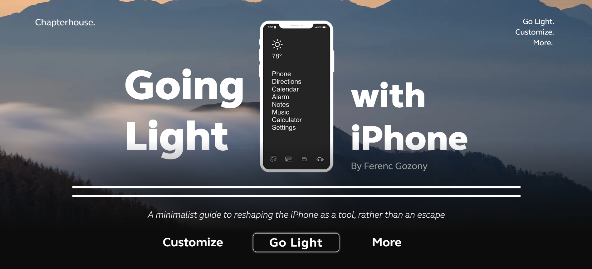
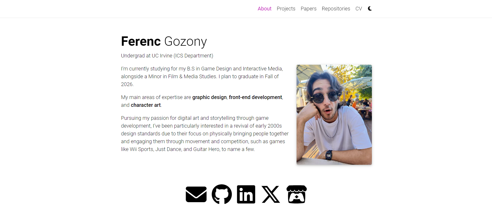

<link rel="stylesheet" href="{{ '/assets/css/style.css' | relative_url }}">
<h2><strong><strong class="highlight-text">// </strong>BranchOut, Inc.</strong></h2>
<h5>Scheduling app designed to make social life easier for college students</h5>

    

<h2><strong><strong class="highlight-text">// </strong>Going Light.</strong></h2>
<h5>Website promoting digital minimalism</h5>

    

<h2><strong><strong class="highlight-text">// </strong>Gozony LNC</strong></h2>
<h5>Comissioned for a Legal Nurse Consulting business</h5>

    

<h2><strong><strong class="highlight-text">// </strong>This Website.</strong></h2>
<h5>Portfolio website created with Al-Folio and Jekyll</h5>

   

<!--
{::comment}
My main areas of expertise are <strong>graphic design</strong>, <strong>front-end development</strong>, and <strong>character art</strong>.

Pursuing my passion for digital art and storytelling through game development, I've been particularly interested in a revival of early 2000s design standards due to their focus on physically bringing people together and engaging them through movement and competition, such as games like Wii Sports, Just Dance, and Guitar Hero, to name a few.

Write your biography here. Tell the world about yourself. Link to your favorite [subreddit](http://reddit.com). You can put a picture in, too. The code is already in, just name your picture `prof_pic.jpg` and put it in the `img/` folder.

Put your address / P.O. box / other info right below your picture. You can also disable any of these elements by editing `profile` property of the YAML header of your `_pages/about.md`. Edit `_bibliography/papers.bib` and Jekyll will render your [publications page](/al-folio/publications/) automatically.

Link to your social media connections, too. This theme is set up to use [Font Awesome icons](https://fontawesome.com/) and [Academicons](https://jpswalsh.github.io/academicons/), like the ones below. Add your Facebook, Twitter, LinkedIn, Google Scholar, or just disable all of them.
{:/comment}
-->